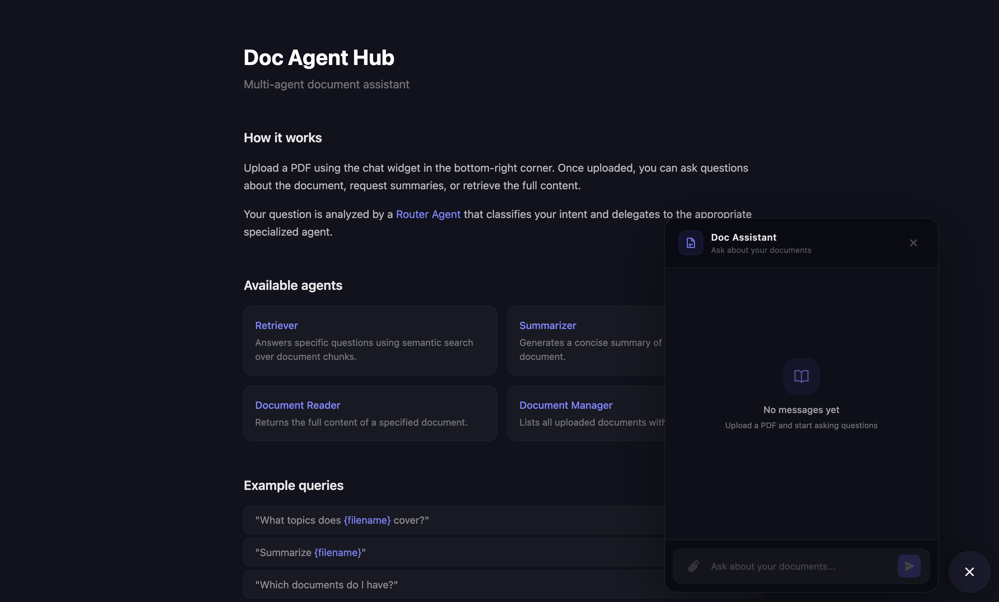
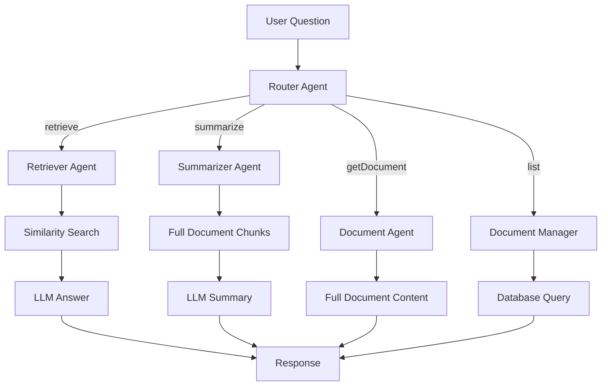

# Doc Agent Hub

A multi-agent document assistant that lets users upload PDFs and interact with them through an intelligent chat interface. Built as a portfolio project to demonstrate multi-agent orchestration, MCP server implementation, and full-stack TypeScript development.



> **Note:** This is an educational and portfolio project, not a production application.

## Table of Contents

- [Architecture](#architecture)
- [Tech Stack](#tech-stack)
- [Features](#features)
- [Example Usage](#example-usage)
- [Setup](#setup)
- [Project Structure](#project-structure)
- [Known Limitations](#known-limitations)
- [What I Learned](#what-i-learned)

## Architecture



The **Router Agent** uses structured output to classify each question into one of four routes and optionally extracts the document name. Each agent is a dedicated node in a LangGraph `StateGraph` with conditional edges.

### Service Architecture

The backend chat pipeline is split into three services following the Single Responsibility Principle:

| Service               | Responsibility                                                                            |
| --------------------- | ----------------------------------------------------------------------------------------- |
| `OrchestratorService` | Assembles the LangGraph `StateGraph` workflow and wires up nodes and edges                |
| `RouterService`       | Contains the `route` node (LLM classification) and `routeToAgents` conditional edge logic |
| `AgentService`        | Contains all agent nodes: `retrieve`, `summarize`, `getDocument`, `listDocuments`         |

### MCP Server

The project includes a standalone **Model Context Protocol (MCP) server** that exposes document tools (`listDocuments`, `searchDocuments`, `getDocumentInfo`, `getDocument`) via the Streamable HTTP transport. External MCP-compatible clients (e.g. Claude Desktop) can connect to `http://localhost:3000/mcp` and use these tools directly.

> **Architecture Decision:** The LangGraph agents call `DocumentsService` directly rather than routing through the MCP server. Self-connecting via HTTP within the same application introduces timing issues and unnecessary overhead. The MCP server exists as an external interface for third-party clients.

## Tech Stack

| Component          | Technology                                  |
| ------------------ | ------------------------------------------- |
| Frontend           | React 19, TypeScript, Vite, Tailwind CSS    |
| Backend            | NestJS, TypeScript                          |
| LLM Orchestration  | LangChain, LangGraph                        |
| Language Model     | OpenAI GPT-5 / GPT-5-mini                   |
| Embeddings         | OpenAI text-embedding-3-small               |
| Vector Storage     | PostgreSQL + pgvector                       |
| MCP Server         | @modelcontextprotocol/sdk (Streamable HTTP) |
| Tracing            | LangSmith                                   |
| Markdown Rendering | react-markdown, remark-gfm                  |

## Features

- **Multi-Agent Routing** — LLM-based router classifies questions and delegates to specialized agents
- **Document Upload** — PDF upload with automatic parsing, chunking, and embedding via LangChain
- **RAG Retrieval** — Semantic similarity search over document chunks with pgvector
- **Document Summarization** — Full document summarization by retrieving all chunks
- **MCP Server** — Standardized tool interface for external clients
- **LLM Tracing** — Workflow traces and agent calls visible in LangSmith
- **Chat Memory** — Conversation persistence per session via LangGraph MemorySaver
- **Chat Widget** — Floating dark-theme widget with file upload, markdown rendering, and loading states
- **Error Handling** — Graceful error messages in both frontend and backend
- **Prompt Injection Protection** — System prompts instruct agents to treat document context as raw data only

## Example Usage

**Upload a document and ask questions:**

```
> [Upload] report.pdf
  "report.pdf uploaded successfully."

> "What topics does report.pdf cover?"
  "An introductory AI course focused on regression methods, covering
   linear regression, logistic regression, sigmoid properties..."

> "Which documents do I have?"
  "- report.pdf (uploaded: 26.03.2026, 17:10)"
```

**Summarize a specific document:**

```
> "Summarize thesis.pdf"
  "The thesis extends the 5Code learning environment from a Java-only
   LSP setup to a multilingual platform, adding Kotlin and Python..."
```

**Get raw document content:**

```
> "Output the content of notes.pdf"
  [Full document text returned]
```

## Setup

### Prerequisites

- Node.js 20+
- Docker
- OpenAI API key
- pnpm

### Installation

```bash
# Clone
git clone https://github.com/AdamBess/doc-agent-hub.git
cd doc-agent-hub

# Environment
cp .env.example .env
# Add your OPENAI_API_KEY, DB_USER, DB_PASSWORD to .env

# Database
docker compose up -d

# Backend
cd backend
pnpm install
pnpm start:dev

# Frontend (new terminal)
cd frontend
pnpm install
pnpm dev
```

Open `http://localhost:5173` — the chat widget appears in the bottom-right corner.

## Project Structure

```
doc-agent-hub/
├── backend/
│   └── src/
│       ├── chat/              # LangGraph workflow, agents, state
│       │   ├── orchestrator.service.ts  # Workflow assembly (StateGraph wiring)
│       │   ├── router.service.ts    # Routing logic (route node + conditional edges)
│       │   ├── agent.service.ts     # Agent nodes (retrieve, summarize, getDocument, listDocuments)
│       │   ├── chat.controller.ts   # POST /chat endpoint
│       │   └── agent.state.ts       # Zod state schema
│       ├── documents/         # Upload pipeline + document queries
│       │   ├── documents.service.ts # PDF parsing, chunking, pgvector
│       │   ├── documents.controller.ts
│       │   └── document.entity.ts
│       ├── mcp/               # MCP server + tools
│       │   ├── mcp.service.ts       # Tool registration
│       │   └── mcp.controller.ts    # Streamable HTTP transport
│       └── health/            # Health check endpoint
├── frontend/
│   └── src/
│       └── chat/
│           └── ChatWidget.tsx # Floating chat widget
├── docker-compose.yml         # PostgreSQL + pgvector
└── .env                       # Environment variables
```

## Known Limitations

- **Duplicate uploads** — Uploading the same file multiple times creates separate entries. When matching by filename, `findOneBy` returns an arbitrary match — not guaranteed to be the most recent upload.
- **Router ambiguity** — Questions like "What is this document about?" may route to `summarize` instead of `retrieve` depending on phrasing. The router works best with explicit intent.
- **Document name matching** — The user must reference the exact filename (including `.pdf`) for summarization and document retrieval to work.
- **Full document retrieval** — The "get document" feature reconstructs document content by running a similarity search with an empty query string (`similaritySearch('', 100, { documentId })`), capped at 100 chunks. This is a misuse of the vector search API: results are ranked by embedding distance rather than document order, so the reassembled text may be out of sequence. For large documents the 100-chunk cap also means content is silently truncated. The correct approach would be to either persist the original file and return it directly, or store chunk position metadata and retrieve chunks via a plain SQL query ordered by position — bypassing the vector store entirely for this use case. Implementing either solution is out of scope for this project.
- **No authentication** — The application has no user authentication or document access control.
- **In-memory chat history** — `MemorySaver` stores conversation state in memory; it is lost on server restart.

## What I Learned

- **Multi-Agent Routing** — Using LLM structured output to classify user intent and route to specialized agents via LangGraph conditional edges
- **LangGraph State Management** — Defining state schemas with Zod, using reducers for message accumulation, and building workflows with `StateGraph`
- **MCP Server Implementation** — Building a Model Context Protocol server with `registerTool` and Streamable HTTP transport, understanding when MCP adds value vs. direct service calls
- **RAG Pipeline** — Document ingestion (parse, chunk, embed, store) and retrieval with pgvector similarity search
- **NestJS Architecture** — Modules, dependency injection, `ConfigService`, `TypeOrmModule.forRootAsync`, and lifecycle hooks (`onModuleInit`)
- **Prompt Engineering** — Crafting system prompts for routing accuracy and adding prompt injection protection for document context
